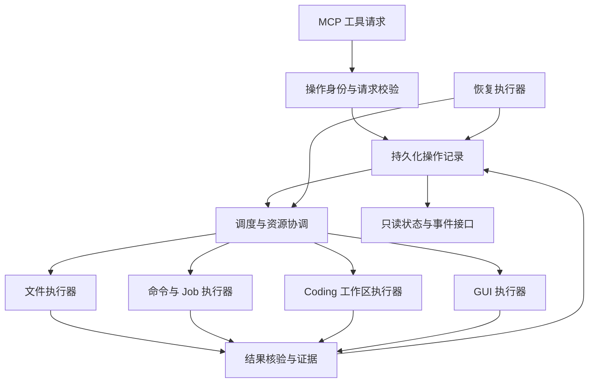

# MCP4ChatGPT 事务能力改进计划与可行性研究

日期：2026-09-28  
状态：方案与研究报告，尚未实施  
审查范围：Coding、终端命令、文件修改、GUI 操作，以及共用的恢复与幂等机制  
代码基线：`084ccec` 加本地未提交修改；结论针对本次读取到的工作区，不代表该提交本身。后续实施前必须重新记录工作区差异。

## 1. 决策摘要

建议实施，但目标应是**按资源类型提供可验证的事务保证**。

建议采用“统一操作记录 + 各类资源专用执行器”的架构，复用现有文件事务、后台 Jobs 和 GUI 身份检查。第一阶段完成文件恢复与任务幂等，第二阶段接入隔离 Coding 工作区，第三阶段补齐 GUI 持久化记录与有限补偿。

不将任意 shell 命令、鼠标点击、网络请求包装成数据库式全有或全无事务。对这些操作，承诺必须落在：执行前检查、避免盲目重放、执行后核验、必要时补偿、无法确认时保留不确定状态。

### 1.1 可行性结论

| 目标 | 判断 | 可交付保证 |
|---|---|---|
| 单文件修改与恢复 | 高 | 合作写入者之间的版本校验；原子替换；可恢复的前后镜像 |
| 多文件 Coding 成果提交 | 高，需受控边界 | 隔离工作区生成完整 Git commit；单个成果 ref 的 CAS 发布 |
| 原地修改多文件时对所有程序瞬间可见 | 不能作为一般保证 | 顺序替换只能提供可恢复批处理；外部读者可能看到中间状态 |
| 长命令防重复启动 | 高 | 同一操作标识重复提交不会盲目启动第二份任务 |
| 任意命令副作用全量撤销 | 一般情形不可实现 | 在隔离环境内限制影响，或为特定命令提供补偿 |
| GUI 单步可靠执行与核验 | 中高 | 目标绑定、动作去重、结果核验、结果不明时停止重试 |
| 跨应用 GUI 全局回滚 | 一般情形不可实现 | 支持少量有条件补偿的步骤；无法补偿的动作单独标识 |
| 四类资源统一 ACID 事务 | 不建议立项 | 使用分步执行、持久化状态和条件补偿的工作流 |

### 1.2 建议批准的范围

- 本机、单用户、多并发客户端；事务元数据位于本地磁盘。
- 新机制默认只保护经 MCP4ChatGPT 受控入口执行的操作。
- 保持现有工具可用；新增严格模式和能力声明，逐步迁移。
- 第一版不引入 WebCodex 作为强依赖，也不改变 CodexPro 的部署。
- 预计完整范围需要 **40–65 工程人日**，另预留 20%–30% 不确定性；这是工作量估算，不是交付承诺。

## 2. 当前实现与证据

### 2.1 已实现的能力

| 领域 | 实现证据 | 当前保证与边界 |
|---|---|---|
| 文件修改 | `workspace/transactions.py`、`recovery.py`、`versioning.py` | 每文件 flock；整文件覆盖要求 SHA 与完整读取证明；临时文件、fsync、os.replace；Git 恢复引用；部分异常回滚 |
| 文件校验 | `workspace/validators.py` | UTF-8、Python 语法、异常缩减检查和特定 CUA 文件结构校验；不等于业务正确性验证 |
| 持久化命令 | `jobs/manager.py`、`store.py`、`runner.py`、`process.py` | operation_id 与请求指纹；启动前预留；独立 supervisor；日志游标、超时、取消和进程身份检查 |
| 同步命令 | `local_ops.py::run_command` | 超时与日志；仍直接执行 shell，未提供全局副作用回滚或操作级去重 |
| GUI | `computer_ops.py`、`computer_cua_backend.py`、`computer_backend.py` | 窗口/进程身份、快照约束、CUA 进程内锁；不确定效果返回 outcome_unknown，限制后端 fallback |
| Coding 隔离 | `workspace/worktrees.py`、`worktree_store.py` | 存在创建、观察、删除模块；当前未发现对应 MCP 工具注册或完整任务编排入口 |

### 2.2 本次验证

在项目 `.venv` 中运行：

```sh
.venv/bin/python -m pytest -q \
  tests/test_local_file_transactions.py \
  tests/test_local_jobs.py \
  tests/test_local_job_tools.py \
  tests/test_computer_cua_backend.py \
  tests/test_computer_v2_ops.py
```

结果：**54 passed in 9.76s**。测试在本次会话前一轮审查中执行；本报告没有把历史文档中的 17 项测试当作当前验收结果。

覆盖现有文件事务、任务生命周期与 GUI 后端逻辑；不是全仓验收，不证明真实 GUI 场景、断电恢复、跨文件原子可见性或跨应用事务。当前工作区已有较多其他改动，实施与测试必须保留这些改动。

### 2.3 缺口和优先级

| 编号 | 缺口 | 影响 | 优先级 |
|---|---|---|---|
| G1 | 文件、Job、GUI 没有统一持久化操作身份和结果语义 | 超时后难以区分已完成、未开始和结果不明 | P0 |
| G2 | 文件备份与日志尚未形成完整启动恢复协议 | 崩溃可能留下 prepared 状态，需要人工判断 | P0 |
| G3 | shell 写文件绕过文件事务 | 任意脚本可以破坏专用写入工具的保证 | P0：明确边界；P1：增加隔离执行 |
| G4 | GUI 快照与锁主要在进程内，缺少跨重启操作记录 | 不能可靠回答旧请求是否已经产生效果 | P1 |
| G5 | 多文件 Coding 缺少统一基线、验证和成果发布 | 部分修改失败后可能留下一半成果 | P1 |
| G6 | worktree 模块尚未完成工具接入与验收 | 不能视为已交付的隔离能力 | P1 |
| G7 | 恢复记录、日志、工件没有完整保留与清理协议 | 存储膨胀，误清理会破坏去重或恢复 | P2 |

## 3. 明确定义保证

### 3.1 四个独立维度

每个操作结果应分别报告：

1. **原子性**：单文件替换、单 Git ref 发布、数据库记录事务，还是仅分步执行。
2. **隔离性**：隔离工作区、合作方锁、桌面独占调度，或无隔离。
3. **重试语义**：操作标识去重、可验证重试、禁止自动重试。
4. **恢复语义**：自动恢复、条件补偿、人工核对或无撤销能力。

“取消”仅表示停止继续执行；“补偿”是新的业务动作；“回滚”才表示恢复事务前状态。三者不可混用。

### 3.2 必须保持的不变量

- 同一作用域内 operation_id 唯一；同 ID 不同参数必须冲突。
- 请求超时不自动等价于执行失败。
- 未能证明没有执行效果时，不自动重新执行。
- 观察接口不启动、修复、取消或重试任务；恢复由独立执行器承担。
- 回滚或补偿前必须再次核验当前版本，不能覆盖用户后续修改。
- 已确认提交后，即使日志更新失败，也不能返回“未发生修改”。
- 新 worker 接管前必须排除旧 worker 仍可写入的可能；仅租约过期不够。
- 操作记录先持久化，再尝试外部效果；外部效果与元数据之间的崩溃窗口必须可表达。

## 4. 总体架构



不建议将网络等待、命令运行或 GUI 等待放在数据库事务内。数据库事务只做短暂状态变更，执行器在事务外完成实际操作。

### 4.1 元数据存储选型

建议新增本地 SQLite 操作库，保留大日志、截图和恢复镜像为独立文件。

| 方案 | 收益 | 代价 | 决策 |
|---|---|---|---|
| 继续扩展 JSON/JSONL | 复用现有代码 | 跨记录一致性、索引和恢复协议越来越复杂 | 保留历史兼容读取 |
| SQLite 统一元数据 | 唯一约束、短事务、状态查询和迁移更清晰 | 需迁移、备份和并发写入管理 | 推荐 |
| 外部数据库/队列 | 跨主机扩展 | 当前单机需求下运维成本过高 | 暂缓 |

建议验证本机 SQLite 版本后选用 WAL、`synchronous=FULL`、合理 busy_timeout，全部核心状态放入一个数据库。WAL 需要同机访问，且仍只有一个并发 writer；不能把 SQLite 的事务能力扩大解释为对 shell、文件和 GUI 的共同事务。[SQLite WAL 文档](https://www.sqlite.org/wal.html)

实施前检查 SQLite 官方已知缺陷和实际绑定版本；若当前版本不满足可靠性条件，先升级依赖或使用经过验证的 rollback journal 配置。数据库通过 backup API 或经验证的停机备份流程备份，不能仅复制正在运行的主数据库文件。

建议数据模型：

| 表 | 核心字段 |
|---|---|
| operations | scope、operation_id、kind、fingerprint、state、effect、revision、result、created_at |
| attempts | attempt_id、operation_id、worker_identity、resource_generation、started_at、ended_at |
| steps | workflow_id、step_id、dependencies、precondition、postcondition、compensation、state |
| events | operation_id、递增序号、状态变化、时间、脱敏诊断 |
| artifacts | 哈希、路径、字节数、类型、引用关系、保留策略 |
| resources | 资源键、当前所有者、generation、心跳、占用状态 |

scope 至少绑定本机安装身份、调用主体和稳定 workspace ID。请求指纹包含规范化参数、目标身份、基线版本、工具契约版本及影响行为的配置摘要；敏感参数不得明文写入普通事件日志。

### 4.2 状态与结果

操作状态建议：`accepted → prepared → running → verifying → succeeded`。

分支状态：`failed`、`cancelled`、`needs_reconciliation`、`compensating`、`compensated`、`compensation_failed`。`failed` 也可能已有部分效果，必须结合 effect 字段解释。

结果至少包含：operation_id、state、effect、replayed、retry_policy、evidence_refs、recovery_action、guarantees。

effect 使用 `none`、`committed`、`partial`、`unknown`、`compensated`。GUI 传输成功仅表示指令返回，业务成功须通过后置条件验证。

重试模型采用客户端显式操作标识，而非仅凭参数相同推断同一意图；重复请求返回同一操作的语义结果。[AWS 幂等 API 设计](https://aws.amazon.com/builders-library/making-retries-safe-with-idempotent-APIs/)

## 5. 文件事务改进

### 5.1 单文件完善

1. 为 write/patch 增加 operation_id；按 ID 查询既有结果，避免超时后重复 patch。
2. 严格模式的 patch 也要求 expected_sha256；兼容模式保留旧行为并明确保证较弱。
3. 明确普通文件、创建、删除、重命名、二进制、权限、符号链接和硬链接的支持矩阵。第一版支持普通文件创建/替换/删除；其他类型未验证前拒绝纳入严格事务。
4. 将新建父目录、权限与扩展属性处理列入协议；未保存的元数据不能宣称完整恢复。macOS ACL/xattr 单独验证。
5. 目标解析与实际打开之间增加身份核验；同目录临时文件、目标 no-follow 策略和父目录边界检查，降低路径竞态。
6. 合作方之外的写入无法仅靠 flock 阻止；严格场景改用隔离工作区，普通场景记录版本冲突。

### 5.2 崩溃恢复决策

提交前持久化目标、before/after 哈希、备份、目标身份、阶段与已知提交证据。重启恢复执行器取得资源锁后：

| 观察结果 | 恢复决策 |
|---|---|
| 目标仍为 before，尚无提交证据 | 标记未应用；按显式策略重新执行或结束 |
| 目标为 after 且提交证据可匹配 | 完成元数据确认，避免重复写入 |
| 目标为第三种内容或身份改变 | 标记冲突并保留镜像，禁止覆盖 |
| 镜像缺失、Git ref 与日志矛盾 | needs_reconciliation，输出可审查证据 |

“哈希等于 after”仅证明当前内容相同；若协议要求证明原请求执行过，还必须结合操作记录与提交标识。回滚只在当前状态仍属于该操作时实施。

### 5.3 多文件语义

提供两种明确区分的模式：

- **隔离成果模式，推荐**：在独立 worktree 中修改全部文件、验证并生成 Git commit，以成果 ref 发布。
- **原地可恢复批处理**：按稳定顺序锁定全部目标，记录所有镜像，逐个替换；失败时条件回滚。它不保证外部读者看不到中间状态。

不以“循环 os.replace”实现名义上的多文件原子事务。无 Git 项目第一版使用 staging 目录和清单，默认只输出候选成果；原地应用需明确其较弱保证。

## 6. 终端命令与 Jobs 改进

### 6.1 统一短长任务身份

短命令也通过操作记录和 Job 执行器运行，只在前台等待一个较短预算。超时返回 job_id，不抹掉实际运行身份。保留 local_run_command 兼容入口；严格模式要求 operation_id。

命令效果分为只读、隔离工作区内写入、外部写入三类。不能仅靠命令字符串静态判断只读；未经可信执行边界验证的任意 shell，视为可能产生外部效果。

### 6.2 启动与崩溃窗口

保留“预留后不盲目重启”的现有保守策略。增加 supervisor 与操作记录的持久化握手、attempt 身份和执行前领取协议；重复 supervisor 只能有一个获得执行资格。

外部进程创建与数据库提交无法组成同一个事务。因此“已领取但不知是否 spawn”的状态仍需核对，不承诺任意进程 exactly-once。允许以不自动重试换取不重复效果。

记录 PID、启动身份、进程组、工作区与 attempt 关联。恢复时不仅判断 PID 存在，还核对身份，避免误杀重用 PID 的进程。

### 6.3 隔离与取消

- Worktree 隔离仓库文件，但不能限制绝对路径、网络、用户主目录等外部效果。
- 普通本地执行明确标记无 OS 级隔离；需要强隔离的构建任务使用单独受控容器/VM，作为可选范围验证。
- 取消后检查子进程和残留效果；逃离进程组的程序可能无法靠 killpg 收敛。
- 取消或超时不能返回“全部撤销”；输出 effects_may_remain 和核验路径。
- 环境、依赖缓存和临时目录尽可能按任务分离，避免修改主运行环境。

## 7. Coding 任务改进

### 7.1 工作流

`创建任务 → 固定基线 → 创建隔离 worktree → 修改 → 验证 → 生成成果 commit → 发布成果 ref → 可选整合`。

首版暴露现有 worktree 模块前，补齐工具契约、路径归属、重复调用、进程占用和恢复测试。开始任务时冻结基线 commit；工作区有未提交内容时明确选择“仅已提交基线”或“显式捕获选定修改”，不得默默丢弃脏修改。

验证证据绑定候选 tree/commit、测试命令、环境摘要、退出码和日志；测试后再改文件必须使旧验证失效。提交只包含任务声明的文件集合，避免把凭证、输出目录或其他任务改动带入成果。

### 7.2 发布与整合

建议默认生成 `refs/mcp4chatgpt/tasks/<task-id>` 成果引用，以预期旧值执行 CAS 更新。单 ref 的受控更新可作为成果发布点；Git 的引用事务不等于工作区文件同时切换，也不能声称任意多引用读取具有快照隔离。[Git update-ref 文档](https://git-scm.com/docs/git-update-ref)

整合到用户工作区是独立步骤：检查当前 HEAD、脏修改和任务基线；发生漂移返回冲突。不得通过 reset --hard 覆盖用户工作区。运行时部署独立验证，不在源码事务中自动重启生产服务。

失败任务保留可审查差异；清理只处理已确认无运行进程、成果已保留且归属明确的工作区。

## 8. GUI 操作改进

### 8.1 单步操作协议

每步包含 operation_id、目标进程/窗口身份、观察版本、动作、前置条件、后置条件、重试规则和可选补偿。

1. 记录执行意图与必要的前状态证据。
2. 获取调度权并重新核验窗口身份、焦点和控件。
3. 记录 dispatching 后发送动作。
4. 重新读取 AX/截图/应用状态，核验后置条件。
5. 持久化结果；超时或断开则进入 needs_reconciliation。

一次性快照继续保留，但不能将失效快照重新执行当作重试。重启后也不能仅因内存快照丢失就判断前次动作未执行。

### 8.2 并发与人的操作

- CUA 后台操作按可证明互不干扰的资源串行化；第一版使用较保守的统一调度。
- 原生鼠标键盘路径使用桌面级调度；多服务进程共享一个有身份校验的 broker。
- 检测用户切窗、控件变化后停止当前步骤并重新观察。
- 调度锁无法锁住人的键盘鼠标，也不能锁住其他自动化软件；因此不承诺整个桌面的严格隔离。
- worker 失联后，新 worker 不因租约过期直接发第二次动作，先核对旧动作结果。

### 8.3 补偿范围

| 操作 | 可实现的补偿 | 条件与限制 |
|---|---|---|
| 设置可读文本字段 | 恢复原值 | 当前值仍等于本步骤写入值；同一控件身份 |
| 更改可读开关 | 恢复先前值 | 开关语义明确，且无后续外部动作 |
| 输入文本/拖动 | 应用专用撤销或状态恢复 | 必须验证，不使用通用 Cmd+Z 假设 |
| 发送、提交、删除、付款 | 通常无可靠撤销 | 优先使用有状态查询/幂等键的 API；GUI 结果不明时核对 |

第一版只选择文本字段和可读开关两类补偿进行真实应用验收。新发出的补偿也拥有 operation_id 和结果核验；补偿失败进入独立状态，不伪装为已回滚。

## 9. 跨领域工作流

使用持久化步骤图：每步声明依赖、效果类型、资源键、前后置条件及补偿。按依赖顺序执行；失败时仅补偿支持撤销的已完成步骤，顺序与依赖相反。

将不可逆步骤尽可能安排在验证完成后。例如：准备代码、运行测试、生成成果，再执行外部发布。已有用户授权继续有效；只有超出授权范围或缺少必要输入时才请求确认，不增加每步审批。

新的统一保证仅覆盖已接入执行器的工具。浏览器扩展 JS、下游 MCP、直接 shell 和外部应用等旁路必须在能力清单中声明其效果与重试规则；未适配工具不自动获得事务保证。

## 10. 接口与代码改动计划

以下均为拟议接口，并非当前工具：

| 接口 | 用途 |
|---|---|
| operation_status / operation_events | 只读结果与事件查询 |
| operation_reconcile | 显式核对不确定效果；与重试分离 |
| workspace_transaction_prepare / commit / abort | 有限文件集合的受控写入 |
| coding_task_create / validate / publish / inspect | 隔离 Coding 生命周期 |
| gui_step_execute / inspect | 有身份和前后置条件的 GUI 单步 |
| workflow_start / inspect / cancel | 分步事务工作流 |

优先保持工具入口少而语义明确；与现有 compact discovery、能力目录及下游工具刷新机制联动测试，不假定工具已注册就一定对客户端可见。

建议新增 `operations/store.py`、`models.py`、`reconcile.py`、`workflows/`；改造现有 `workspace/`、`jobs/` 和 `computer_*`，避免复制第二套文件写入或进程管理实现。

## 11. 分阶段实施计划

各阶段先通过退出门槛再扩大范围。人日包含实现、测试和文档；按一名熟悉项目的工程师估算。

| 阶段 | 工作与交付 | 退出门槛 | 估算 |
|---|---|---|---|
| P0 基线与契约 | 记录源码差异；保证矩阵；失败状态；故障注入框架 | 每个现有入口的边界有测试/文档对应 | 3–5 人日 |
| P1 操作记录与恢复 | SQLite 版本验证；操作/事件模型；幂等；恢复执行器；兼容读取 | 重放、参数冲突、跨进程并发、崩溃窗口通过 | 7–10 人日 |
| P2 文件与 Jobs | 文件 operation_id、恢复、条件回滚；短长命令统一；supervisor 核对 | 无陈旧覆盖、无盲目重复启动、结果不明如实报告 | 8–12 人日 |
| P3 Coding | worktree 工具接入；基线、验证、成果 ref、冲突流程 | 两任务并行；失败不污染源工作区；成果可重现验证 | 7–11 人日 |
| P4 GUI | 持久化动作身份、调度、后置条件、两类补偿 | 真实应用验证；失联不重复动作；用户干扰停止 | 10–17 人日 |
| P5 集成上线 | 跨域工作流；迁移、备份、保留；全量回归与灰度 | 故障矩阵、兼容客户端和真实使用全部达标 | 5–10 人日 |

合计 40–65 人日；加预留后约 48–85 人日，一人全职约 10–17 个工作周。优先交付 P0–P2 约 18–27 人日，能先解决最常见的数据覆盖和重复执行问题。两名工程师可以分担执行器与测试，但状态协议和集成路径限制线性提速；本报告不启动额外代理或开发任务。

第一版不包含：通用跨主机事务、所有 GUI 应用适配、网络服务全局补偿、任意 shell 沙箱、生产部署无停机切换。纳入这些能力需要另行估算。

## 12. 验收矩阵

| 场景 | 注入方式 | 必须结果 |
|---|---|---|
| 并发旧版本覆盖 | 两客户端读取同版本后写入 | 仅匹配基线的修改成功，另一方冲突 |
| 响应丢失后重放 | 完成后丢弃响应，以同 ID 重试 | 返回原结果，不二次 patch/启动/点击 |
| 同 ID 不同参数 | 修改命令或目标 | 幂等冲突，不产生新效果 |
| 文件提交中崩溃 | 每个持久化点前后 SIGKILL | 完整旧/新文件或明确恢复状态，无静默损坏 |
| 恢复前有人修改 | 将目标改为第三种内容 | 保留用户修改，不盲目回滚 |
| 磁盘满/权限失效 | 备份、替换、fsync、记账阶段失败 | 明确提交点和效果；不错误宣称未修改 |
| Job 启动窗口崩溃 | 预留、领取、spawn、记账之间中断 | 不盲目再次启动；可核对原任务 |
| Job 取消与 PID 重用 | 子孙进程、旧 PID、新身份 | 不误杀其他进程，残留状态明确 |
| 两个 Coding 任务 | 同基线不同 worktree | 修改隔离，发布冲突可检测 |
| 验证后代码变化 | 测试后再修改文件 | 旧测试证据失效，禁止作为已验证成果发布 |
| GUI 失联 | 动作发出后断开连接 | unknown，重新观察，不自动 fallback 重放 |
| GUI 用户干扰 | 切窗、改字段、关应用 | 身份/前置条件失败，无后续错误动作 |
| GUI 补偿冲突 | 动作后用户再编辑 | 不覆盖用户新输入 |
| 元数据库恢复 | 备份恢复、进程重启 | 操作身份和工件引用一致，缺失有明确错误 |
| 工具发现兼容 | compact/direct/downstream 场景 | 能力声明与实际可调用工具一致 |

测试层次：纯单元 → 临时目录/Git/进程集成 → 多进程并发 → 故障注入 → 真实测试应用 → 人工参与桌面验收。GUI 测试使用专用测试窗口与临时文档，避免触碰真实业务内容。

建议首轮量化门槛：每个关键故障点至少重复 20 次；同一操作 20 个并发重放不产生第二份受控效果；至少 1,000 次随机混合操作无静默数据丢失。数字是拟议验收目标，不代表数学证明或已完成测试。

SIGKILL 不等于断电。硬重启/存储故障需要单独实验环境；未验证之前只声明进程崩溃恢复级别。

性能先测基线：操作登记和查询 P50/P95、SQLite 锁等待、恢复耗时、工件增长。暂定本机新增元数据开销 P95 ≤50ms，100 个待核对记录的纯元数据扫描 ≤5s；GUI/网络/进程核验另计。未达标先定位 I/O 与队列，不通过降低持久化级别掩盖问题。

## 13. 上线、迁移与运维

1. 在隔离开发工作区实施；稳定运行服务继续使用已验证版本。
2. 先做兼容读取和影子记录，不改变旧任务的实际所有权。
3. 迁移时停止接受新写操作，等待旧 supervisor 结束或通过明确协议交接；不能只重启 MCP 主进程后就假定旧写入者已停止。
4. 备份原 JSON 状态、恢复 blobs、Git refs 和数据库。迁移标记必须可重复执行。
5. 避免长期双写两个权威存储；切换后 SQLite 为新操作的唯一状态源，旧记录只读保留。
6. 按文件 → Jobs → Coding → GUI → 工作流逐项启用；故障时暂停新写入，状态读取保持可用。
7. 回退只能到理解当前 schema 的兼容版本；有未完成新协议操作时，不直接切回会忽略它们的旧版本。

建议保留：未解决操作及其工件不自动清理；已完成日志可配置 30 天、恢复工件 90 天。幂等键至少覆盖客户端重试窗口；删除正文后保留 tombstone，防止旧 ID 被当作新任务。具体容量策略需结合实际使用量调整。

日志与截图可能包含私有内容；恢复 blobs 和操作库限制本机访问，诊断输出脱敏。备份应连同工件引用校验；恢复演练必须验证可用性。元数据损坏不应触发自动执行任何外部效果。

监控重点：needs_reconciliation 数量/年龄、重复请求率、版本冲突、补偿失败、孤儿进程、数据库 busy、磁盘空间、GUI 身份失配、恢复工件缺失。

## 14. 成本、收益与替代路线

### 14.1 成本模型

主要成本是工程与验收，不是基础设施：SQLite、Git 和现有 Python 运行时可复用。GUI 专用测试环境、真实应用适配、磁盘保留和可选 VM 隔离会增加成本。

总预算可按“48–85 人日 × 实际内部日成本 + 测试设备/存储/可选 VM 成本”计算；未提供人员单价，报告不虚构金额。实际磁盘需求取决于镜像、日志、截图和保留天数，应先采集一周基线。

### 14.2 路线比较

| 路线 | 优点 | 风险/限制 | 建议 |
|---|---|---|---|
| 仅修补现有模块 | 上线快 | 跨模块状态仍分散 | 可作为 P0，但不足以完成目标 |
| 统一记录 + 专用执行器 | 保留已有能力、保证边界清晰 | 需要迁移与故障测试 | 推荐主线 |
| Coding 全部委托 WebCodex | 可能减少重复开发 | 要重新评估后端契约；不能解决 GUI 和外部副作用事务 | 可选后续研究，本次未验证其事务保证 |
| 引入大型工作流平台 | 编排与观测现成 | 单机项目运维复杂度明显上升，仍无法自动撤销任意效果 | 暂不采用 |

预期收益：减少陈旧覆盖、重复命令和超时后盲重试；能定位不确定状态并保留恢复依据。没有事故频率、修复时长和任务量基线，暂不能可信计算 ROI 百分比。

## 15. 主要风险与应对

| 风险 | 应对 |
|---|---|
| 把调度锁当作隔离或回滚 | 在工具结果中分别声明保证；验收检查外部干扰 |
| SQLite 与文件/Git 状态不一致 | 显式阶段和提交证据；恢复执行器核对，禁止假定跨资源 ACID |
| 任意 shell 逃出工作区 | 清楚声明执行边界；强需求用真实隔离环境 |
| GUI 应用升级改变控件语义 | 应用适配器版本化，后置条件失败即停止 |
| 旧任务与新状态库同时写入 | 迁移停写、等待或交接旧 supervisor，避免双权威 |
| 仓库中其他并行修改 | 固定实施基线、隔离开发、保存原有差异 |
| 恢复自动覆盖用户新内容 | before/after/当前三方核对；冲突保留 |
| 过度扩展为通用分布式事务平台 | 先交付 P0–P2，逐阶段评估收益 |

## 16. 首批实施 Backlog

- [ ] 记录精确源码基线、现有工作区修改和当前进程使用的版本。
- [ ] 固化上述保证矩阵、错误码、状态转移与工具兼容策略。
- [ ] 检查 Python SQLite 版本及官方已知问题，验证所选持久化配置。
- [ ] 建立最小 operations store 和 operation_id 并发测试。
- [ ] 文件 write/patch 接入身份记录，补齐冲突与丢失响应测试。
- [ ] 实现文件恢复扫描与“第三种内容”保护。
- [ ] 短命令复用持久化执行器，完善 uncertain spawn 状态核对。
- [ ] 完成 worktree 模块注册、归属检查和隔离 Coding 验收。
- [ ] GUI 操作记录与 broker 原型，仅在测试应用验证。
- [ ] 两类 GUI 条件补偿、跨域步骤状态与灰度发布。

## 17. 研究依据与结论限制

### 本地源码与文档

下列路径均相对 `/Users/vickers/Documents/MCP_Creator/MCP4ChatGPT`：

- `src/mcp4chatgpt/workspace/transactions.py`：单文件写入与 patch。
- `src/mcp4chatgpt/workspace/recovery.py`：原子替换、镜像及 Git refs。
- `src/mcp4chatgpt/workspace/worktrees.py`：待接入的隔离工作区能力。
- `src/mcp4chatgpt/jobs/{manager,store,runner,process}.py`：后台任务机制。
- `src/mcp4chatgpt/local_ops.py`：同步命令和本地工具入口。
- `src/mcp4chatgpt/computer_{ops,cua_backend,backend}.py`：GUI 路由与执行边界。
- `src/mcp4chatgpt/tools.py`：实际工具注册与能力暴露。
- `docs/13-workspace-transactions-and-durable-jobs.md`：已有设计与历史记录；涉及“下一步”和历史测试数字以本次源码核对为准。

### 外部一手资料

- [SQLite 原子提交](https://www.sqlite.org/atomiccommit.html)：用于核对数据库事务边界。
- [SQLite WAL](https://www.sqlite.org/wal.html)：用于存储部署、并发和持久化配置研究。
- [Git update-ref](https://git-scm.com/docs/git-update-ref)：用于成果引用 CAS 发布设计。
- [AWS：幂等 API 与安全重试](https://aws.amazon.com/builders-library/making-retries-safe-with-idempotent-APIs/)：用于操作身份与重试契约。

本报告是代码审查与方案可行性研究，不是新增能力的实现验收。数据库选型、状态模型、阶段工期及量化指标属于建议；GUI 适配成本、强隔离运行时和异常断电保证需要原型实验后收敛。

**最终建议：先批准 P0–P2，把文件与命令的恢复基础做完整；在这一基础上交付 Coding 隔离和有限 GUI 补偿。以每项可测试的保证作为发布标准。**
